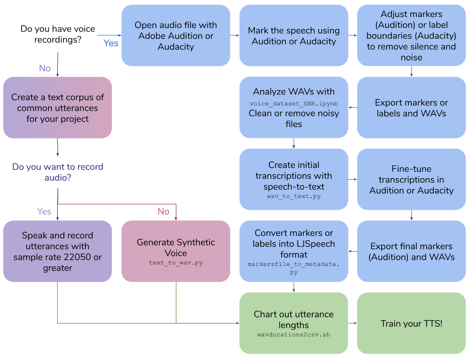
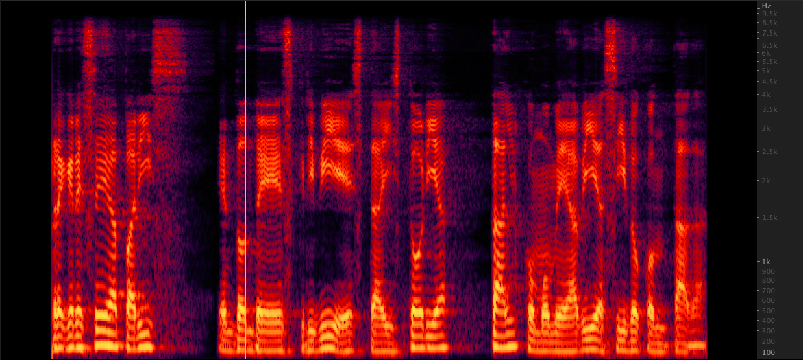

# Voice Dataset Creation
This repo outlines the steps and scripts necessary to create your own text-to-speech dataset for training a voice model. The final output is in LJSpeech format.



## Table of Contents
* [Create Your Own Voice Recordings](#-create-your-own-voice-recordings)
* [Create a Synthetic Voice Dataset](#-create-a-synthetic-voice-dataset)
* [Create Transcriptions for Existing Voice Recordings](#-create-transcriptions-for-existing-voice-recordings)
* [Other Utilities](#other-utilities)

***

##  Create Your Own Voice Recordings

### Requirements
* Voice Recording Software
* Omni-directional head-mounted microphone
* Good quality audio card

### Create a Text Corpus of Utterances
* Create utterances that will be about 3-10 seconds when spoken
* Use LJSpeech format
    * "|" separated values, wav file id then utterance text
    * `100|this is an example utterance`

### Speak and Record Utterances
* Speak each utterance as written
* Sample rate should be 22050 or greater

### Utterance Lengths
Run [scripts/wavdurations2csv.sh](scripts/wavdurations2csv.sh) to chart out utterance length and verify that you have a good distribution of WAV file lengths.

***

##  Create a Synthetic Voice Dataset

### Requirements
* Google Cloud Platform Compute Engine Instance
    * `Cloud API access scopes` select `Allow full access to all Cloud APIs`
* Conda

### Installation
Create Conda Environment on GCP Instance

```bash
conda create -n tts python=3.7
conda activate tts
pip install google-cloud-speech tqdm pandas
```

### Create a Text Corpus of Utterances
* Create utterances that will be about 3-10 seconds when spoken
* Use LJSpeech format
    * "|" separated values, wav file id then utterance text
    * `100|this is an example utterance`

### Generate Synthetic Voice Dataset
* ~~Run `scripts/text_to_wav.py`~~ <-TODO

### Utterance Lengths
Run [scripts/wavdurations2csv.sh](scripts/wavdurations2csv.sh) to chart out utterance length and verify that you have a good distribution of WAV file lengths.

***

##  Create Transcriptions for Existing Voice Recordings

### Requirements
* Adobe Audition or Audacity
* Google Cloud Platform Compute Engine Instance
    * `Cloud API access scopes` select `Allow full access to all Cloud APIs`
* Conda

### Installation
Create Conda Environment on GCP Instance

```bash
conda create -n stt python=3.7
conda activate stt
pip install google-cloud-speech tqdm pandas
```

### Mark the Speech
In **Adobe Audition**, open audio file:
* Select `Diagnostics` -> `Mark Audio`
* Select the `Mark the Speech` preset
* Click `Scan`
* Click `Find Levels`
* Click `Scan` again
* Click `Mark All`
* Adjust audio and silence signal dB and length until clips are between 3-10 seconds

Or, in **Audacity**, open audio file:
* Select `Analyze`->`Sound Finder`
* Adjust audio and silence signal dB and length until clips are between 3-10 seconds

### Adjust Markers or Label Boundaries
In **Audition**:
* Open `Markers` Tab
* Adjust markers, removing silence and noise to make clip length between 3 to 10 seconds long

In **Audition**:
* Adjust label boundaries, removing silence and noise to make clip length between 3 to 10 seconds long

### Export Markers/Labels and WAVs
In **Audition**:
* Select all markers in list
* Select `Export Selected Markers to CSV` and save as Markers.csv
* Select `Preferences` -> `Media & Disk Cache` and Untick `Save Peak Files`
* Select `Export Audio of Selected Range Markers` with the following options: 
    * Check `Use marker names in filenames`
    * Update Format to `WAV PCM`
    * Update Sample Type `22050 Hz Mono, 16-bit`
    * Use folder `wavs_export`

Or, in **Audacity**:
* Select `Export multiple...`
    * Format: WAV
    * Options: Signed 16-bit PCM
    * Split files based on Labels
    * Name files using Label/Track Name
    * Use folder `wavs_export`
* Select `Export labels` to `Label Track.txt`

### Analyze WAVs with Signal to Noise Ratio Colab
TODO: git pull repo and use wav directory instead of wavs.tar.gz

* run [colabs/voice_dataset_SNR.ipynb](colabs/voice_dataset_SNR.ipynb)
* Clean or remove noisy files

### Create Initial Transcriptions with STT
For **Audition**, using the exported `Markers.csv` and wavs folder run:
```bash
cd scripts
python wav_to_text.py audition
```
The script generates a new file, `Markers_STT.csv`.

For **Audacity**, using the exported `Label Track.txt` and wavs folder run:
```bash
cd scripts
python wav_to_text.py audacity
```
The script generates a new file, `Label Track STT.csv`.

### Fine-tune Transcriptions
For **Audition**:
* Delete all markers
* Select `Import Markers from File` and select file with STT transcriptions: Markers_STT.csv
* Fine-tune the Description field in Markers to exactly match the words spoken

For **Audacity**:
* Open `Label Track STT.txt` in a text editor.
* Fine-tune the Labels field in the text file to exactly match the words spoken

### Export Markers (Audition only) and WAVs
For **Audition**:
* Select all markers in list
* Select `Export Selected Markers to CSV` and save as Markers.csv
* Select `Export Audio of Selected Range Markers` with the following options: 
    * Check `Use marker names in filenames`
    * Update Format to `WAV PCM`
    * Update Sample Type `22050 Hz Mono, 16-bit`
    * Use folder `wavs_export`

For **Audacity**:
* Select `Export multiple...`
    * Format: WAV
    * Options: Signed 16-bit PCM
    * Split files based on Labels
    * Name files using Label/Track Name
    * Use folder `wavs_export`

### Convert Markers(Audition) or Labels(Audacity) into LJSpeech format
Using the exported `Markers.csv`(Audition) or `Label Track STT.txt` (Audacity) and WAVs in wavs_export, [scripts/markersfile_to_metadata.py](scripts/markersfile_to_metadata.py) will create a metadata.csv and folder of WAVs to train your TTS model:

For **Audition**:
```bash
python markersfile_to_metadata.py audition
```

For **Audacity**:
```bash
python markersfile_to_metadata.py audacity
```

### Utterance Lengths
Run [scripts/wavdurations2csv.sh](scripts/wavdurations2csv.sh) to chart out utterance length and verify that you have a good distribution of WAV file lengths.

***

## Other Utilities

### Upsample WAV file
 
We tested three methods to upsample WAV files from 16,000 to 22,050 Hz. After reviewing the spectrograms, we selected ffmpeg for upsampling as it includes another 2 KHz of high end information when compared to resampy. [scripts/resamplewav.sh](scripts/resamplewav.sh)
```
scripts/resamplewav.sh
```

## References
* Mozilla TTS: https://github.com/mozilla/TTS
* Automating alignment, includes segment audio on silence, Google Speech API, and recognition alignment: https://github.com/carpedm20/multi-Speaker-tacotron-tensorflow#2-2-generate-korean-datasets
* Pretraining on large synthetic corpuses and fine tuning on specific ones https://twitter.com/garygarywang