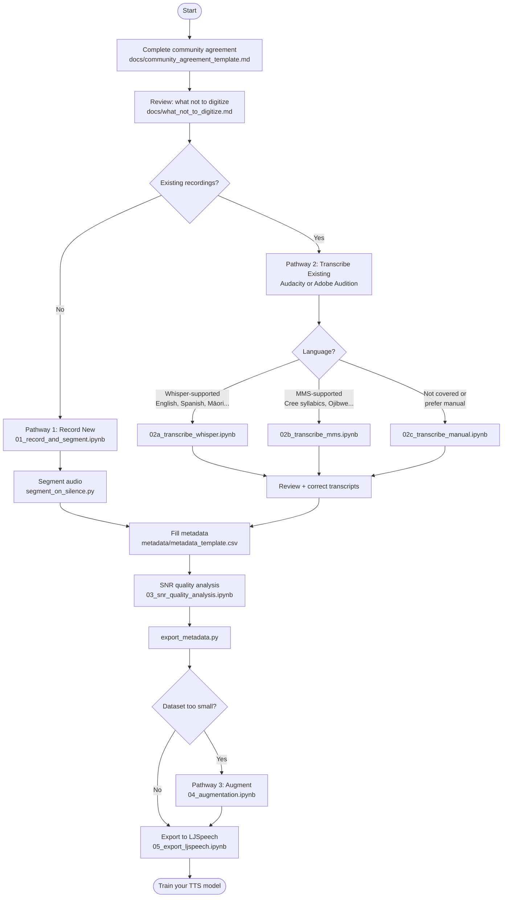

# Community Voice Dataset Creation

This repository supports communities in building voice datasets for language preservation and AI development. It is a digital companion to the chapter "AI Techniques for Indigenous Cultural Expression" in the the book "Envisioning Indigenous Methods in Digital Media and Ecologies".


```mermaid
flowchart TD
    A([Start]) --> B[Complete community agreement\ndocs/community_agreement_template.md]
    B --> C[Review: what not to digitize\ndocs/what_not_to_digitize.md]
    C --> D{Existing recordings?}

    D -->|No| P1[Pathway 1: Record New\n01_record_and_segment.ipynb]
    D -->|Yes| P2[Pathway 2: Transcribe Existing\nAudacity or Adobe Audition]

    P1 --> SEG[Segment audio\nsegment_on_silence.py]
    SEG --> META

    P2 --> LANG{Language?}
    LANG -->|"Whisper-supported\nEnglish, Spanish, Māori..."| W[02a_transcribe_whisper.ipynb]
    LANG -->|"MMS-supported\nCree syllabics, Ojibwe..."| M[02b_transcribe_mms.ipynb]
    LANG -->|"Not covered or\nprefer manual"| MAN[02c_transcribe_manual.ipynb]
    W & M & MAN --> REV[Review + correct transcripts]
    REV --> META

    META[Fill metadata\nmetadata/metadata_template.csv] --> SNR
    SNR[SNR quality analysis\n03_snr_quality_analysis.ipynb] --> EMETA
    EMETA[export_metadata.py] --> AUG{Dataset too small?}

    AUG -->|Yes| P3[Pathway 3: Augment\n04_augmentation.ipynb]
    AUG -->|No| EXP
    P3 --> EXP

    EXP[Export to LJSpeech\n05_export_ljspeech.ipynb] --> DONE([Train your TTS model])
```

> Before beginning, read [docs/what_not_to_digitize.md](docs/what_not_to_digitize.md). Not all recordings should become training data. This is the most important decision in the workflow.

---

## Guiding Principles

This repository is designed in alignment with the [CARE Principles for Indigenous Data Governance](https://www.gida-global.org/care) (Collective Benefit, Authority to Control, Responsibility, Ethics). See [CARE_PRINCIPLES.md](CARE_PRINCIPLES.md) for how each principle is enacted here, and [CHANGELOG.md](CHANGELOG.md) for the full history of changes from the 2020 original.

---

## Table of Contents

- [Community Voice Dataset Creation](#community-voice-dataset-creation)
  - [Guiding Principles](#guiding-principles)
  - [Table of Contents](#table-of-contents)
  - [Setup](#setup)
  - [Pathway 1: Record Your Own Voice](#pathway-1-record-your-own-voice)
    - [Before Recording](#before-recording)
    - [Recording Requirements](#recording-requirements)
    - [Segment and Label](#segment-and-label)
    - [Check Sentence Lengths](#check-sentence-lengths)
  - [Pathway 2: Transcribe Existing Recordings](#pathway-2-transcribe-existing-recordings)
    - [Mark and Export](#mark-and-export)
    - [Transcribe with Whisper](#transcribe-with-whisper)
    - [Review and Correct Transcriptions](#review-and-correct-transcriptions)
    - [Analyze Signal-to-Noise Ratio](#analyze-signal-to-noise-ratio)
    - [Export to Metadata](#export-to-metadata)
  - [Pathway 3: Augment a Small Dataset](#pathway-3-augment-a-small-dataset)
  - [Metadata Schema](#metadata-schema)
  - [Export to LJSpeech Format](#export-to-ljspeech-format)
  - [Utilities](#utilities)
    - [Upsample WAV files (16 kHz → 22050 Hz)](#upsample-wav-files-16-khz--22050-hz)
  - [References](#references)

---

## Setup

**Requirements:** Python 3.11+, [uv](https://github.com/astral-sh/uv), `ffmpeg`, `sox`

```bash
# Install uv if you don't have it
curl -LsSf https://astral.sh/uv/install.sh | sh

# Create environment and install exact locked dependencies (verifies hashes)
uv sync --extra dev
source .venv/bin/activate   # Windows: .venv\Scripts\activate
```

`uv sync` installs from `uv.lock`, which pins exact versions and verifies package hashes — protecting against supply chain attacks like the 2026 litellm incident. Never run `uv pip install` without the lockfile when working with sensitive community data.

No cloud credentials are required. All transcription runs locally.

**Updating dependencies (maintainers):** Edit `pyproject.toml`, then run `uv lock` to regenerate the lockfile before committing.

---

## Pathway 1: Record Your Own Voice

**Notebook:** [notebooks/01_record_and_segment.ipynb](notebooks/01_record_and_segment.ipynb)

This pathway is for communities recording new speech with consenting speakers.

### Before Recording

1. Complete the [Community Data Agreement](docs/community_agreement_template.md) with each speaker. For institutional-level governance documentation (dataset ownership, funding, access policies), fill out the [Adapted Datasheet for Indigenous Datasets](docs/adapted_datasheet_for_indigenous_datasets.md).
2. Work through [docs/what_not_to_digitize.md](docs/what_not_to_digitize.md) to identify any material that should not be recorded or should be restricted.
3. Prepare `metadata/metadata_template.csv` — fill in speaker consent tiers and cultural protocol notes before the session.

### Recording Requirements

- Omni-directional or cardioid head-mounted microphone
- Quiet, acoustically treated room
- Sample rate: 22050 Hz or higher, mono, 16-bit PCM

### Segment and Label

In **Audacity**:
- Open your recording and select `Analyze` → `Sound Finder`
- Adjust dB thresholds until clips are 3–10 seconds
- Export labels: `File` → `Export` → `Export Labels` → save as `Label Track.txt`
- Export WAVs: `File` → `Export` → `Export Multiple...`
  - Format: WAV, Signed 16-bit PCM
  - Split on Labels, name by Label/Track Name
  - Output folder: `wavs_export`

Or run the segmentation script directly:

```bash
python scripts/segment_on_silence.py --input recording.wav --output-dir test_data/wavs_export_audacity
```

### Check Sentence Lengths

```bash
scripts/wavdurations2csv.sh
```

---

## Pathway 2: Transcribe Existing Recordings

This pathway is for communities digitizing existing recordings (cassettes, reel-to-reel, field recordings). All transcription runs locally — no audio leaves community infrastructure.

Choose the notebook for your language:

| Language | Notebook |
|---|---|
| English, Spanish, Māori, or other [Whisper-supported language](https://github.com/openai/whisper#available-models-and-languages) | [notebooks/02a_transcribe_whisper.ipynb](notebooks/02a_transcribe_whisper.ipynb) |
| Navajo or other language in the [MMS list](https://dl.fbaipublicfiles.com/mms/misc/language_coverage_mms.html) | [notebooks/02b_transcribe_mms.ipynb](notebooks/02b_transcribe_mms.ipynb) |
| Language not covered by either tool, or community prefers manual | [notebooks/02c_transcribe_manual.ipynb](notebooks/02c_transcribe_manual.ipynb) |

### Mark and Export

Follow the same Audacity segmentation steps from Pathway 1, or use Adobe Audition:
- `Diagnostics` → `Mark Audio` → `Mark the Speech` preset
- Export markers to `Markers.csv` and WAVs to `wavs_export/`

### Analyze Signal-to-Noise Ratio

Run [notebooks/03_snr_quality_analysis.ipynb](notebooks/03_snr_quality_analysis.ipynb) to identify and remove poor-quality recordings before training.

### Export to Metadata

```bash
python scripts/export_metadata.py audacity \
  --metadata-template metadata/metadata_template.csv
```

---

## Pathway 3: Augment a Small Dataset

**Notebook:** [notebooks/04_augmentation.ipynb](notebooks/04_augmentation.ipynb)

This pathway extends an existing authentic dataset without introducing synthetic voices. It is appropriate when a community has a small number of real recordings and needs more training data.

> **Note:** The [Te Hiku Media](https://tehiku.nz/) approach of collecting 310+ hours from real speakers is the gold standard. Augmentation is a practical compromise, not a substitute for real recordings.

Techniques available: speed perturbation, pitch shifting, additive noise (white, brown, room impulse response).

All augmented files are flagged in metadata with `provenance_note: "augmented from {source_id}"`.

---

## Metadata Schema

Every recording gets structured provenance. See [docs/metadata_schema.md](docs/metadata_schema.md) for full field documentation.

Template: [metadata/metadata_template.csv](metadata/metadata_template.csv)

Key fields:

| Field | Purpose |
|---|---|
| `consent_tier` | `open` / `community` / `restricted` |
| `cultural_protocol` | Free text — e.g., "seasonal restriction: winter only" |
| `knowledge_keeper_reviewed` | Boolean |
| `exclude_from_training` | Boolean — keeps recording in archive but out of model |
| `exclude_reason` | Required when `exclude_from_training` is true |

---

## Export to LJSpeech Format

**Notebook:** [notebooks/05_export_ljspeech.ipynb](notebooks/05_export_ljspeech.ipynb)

The final step packages reviewed, consented recordings into the [LJSpeech format](https://keithito.com/LJ-Speech-Dataset/) used by most TTS fine-tuning pipelines.

Only recordings where `exclude_from_training == False` and `consent_tier` is `open` or `community` are included. Restricted and sacred recordings are preserved in the archive but never exported.

---

## Utilities

### Upsample WAV files (16 kHz → 22050 Hz)

```bash
scripts/resamplewav.sh
```

ffmpeg is used (not resampy) — it preserves more high-frequency content. See spectrograms in `assets/`.

---

## References

- CARE Principles for Indigenous Data Governance: https://www.gida-global.org/care
- Te Hiku Media Kaitiakitanga License: https://github.com/TeHikuMedia/Kaitiakitanga-License
- Whisper (local speech recognition): https://github.com/openai/whisper
- LJSpeech Dataset format: https://keithito.com/LJ-Speech-Dataset/
- Datasheets for Datasets (Gebru et al.): https://arxiv.org/abs/1803.09010
- Adapted Datasheet for Indigenous Datasets (OCAP®-based): [docs/adapted_datasheet_for_indigenous_datasets.md](docs/adapted_datasheet_for_indigenous_datasets.md)
- Mozilla TTS: https://github.com/mozilla/TTS
